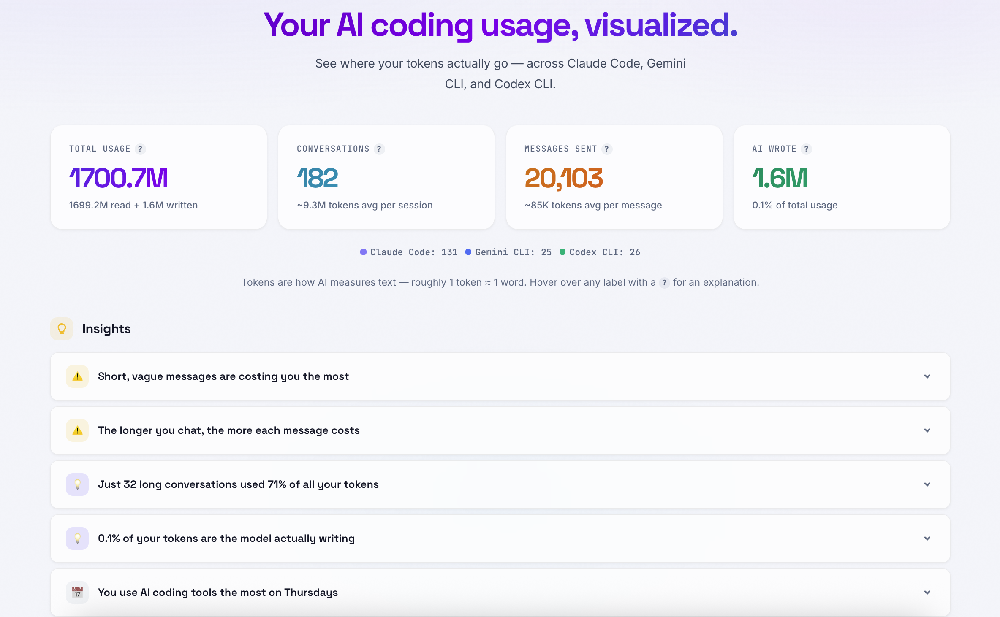
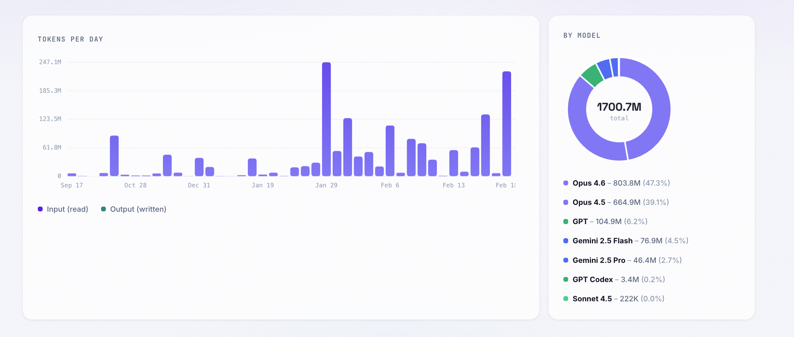
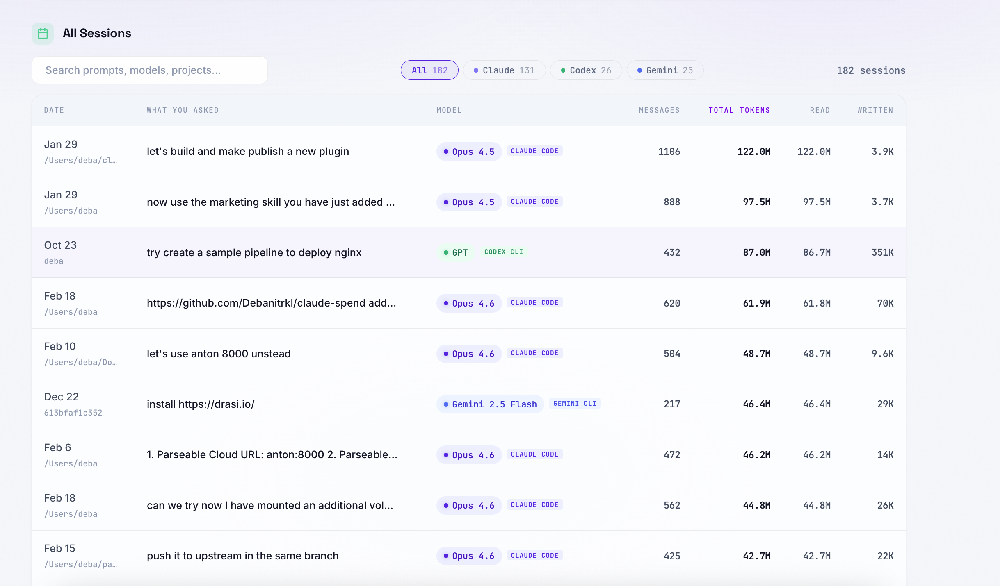

# Coding Agent Usage



**You're burning through more tokens than you think.**

If you use AI coding agents — Claude Code, Gemini CLI, Codex CLI — you're sending thousands of messages, across hundreds of sessions, consuming billions of tokens. But you have zero visibility into where those tokens actually go. Which sessions were expensive? Which model eats the most? Are your short throwaway prompts quietly costing more than your deep coding sessions? You don't know, because nobody shows you.

**Coding Agent Usage** fixes that. It reads your local session files, crunches the numbers, and gives you a clean dashboard with everything laid out — total usage, daily trends, per-model breakdown, per-session drill-down, and actionable insights about your usage patterns. No signup, no cloud, no API keys. Just one command.

```
npx coding-agent-usage
```

## Why track token usage?

- **Token waste is invisible.** Most developers have no idea that a single vague prompt in a long conversation can burn 50M+ tokens in context replay. Short, lazy messages like "fix this" or "try again" inside long sessions are the silent killers.
- **Context windows compound.** Every message in a conversation re-sends the entire history. A 500-message session doesn't cost 500x — it costs exponentially more because each turn includes all previous turns as context.
- **Not all models cost the same.** Opus is 15x more expensive per token than Haiku. Knowing which model you're actually using (and how often) is the first step to optimizing.
- **Multi-tool usage adds up fast.** If you're switching between Claude Code, Gemini CLI, and Codex CLI throughout the day, your total usage is scattered across three different directories with no unified view. Until now.

## What it shows you

- **Total tokens read vs. written** — spoiler: 99%+ of your tokens are read (context), not written (output). The model reads far more than it writes.
- **Daily usage trends** — see spikes, identify heavy days, and track how your usage changes over time
- **Model breakdown** — donut chart showing exactly which models consumed what percentage (Opus 4.6, Sonnet 4.5, Gemini 2.5 Flash, GPT, etc.)
- **Per-session detail** — every conversation with message count, total tokens, read/written split, model used, and source tool
- **Smart insights** — automatically surfaces patterns like "short vague messages are costing you the most", "just 32 sessions used 71% of all tokens", or "you use AI tools most on Thursdays"
- **Provider filtering** — toggle between All / Claude / Gemini / Codex to see tool-specific usage
- **Dark and light theme** — persistent preference





## Install

```
npx coding-agent-usage
```

Opens a dashboard at `localhost:3456`. That's it. No config, no setup, no dependencies to install globally.

## Supported tools

| Tool | Session location | Format |
|---|---|---|
| Claude Code | `~/.claude/projects/` | JSONL |
| Gemini CLI | `~/.gemini/tmp/*/chats/` | JSON |
| Codex CLI | `~/.codex/sessions/` | JSONL |

Each tool is parsed independently and in parallel. If a tool isn't installed or has no sessions, it's silently skipped.

## Options

```
coding-agent-usage --port 8080       # custom port (default: 3456)
coding-agent-usage --no-open         # don't auto-open browser
```

## OTLP Export

Send your token usage metrics to any OpenTelemetry-compatible backend — Grafana, Datadog, Parseable, Prometheus, or anything that speaks OTLP.

### From the dashboard (no restart needed)

The **OpenTelemetry Export** card lets you configure the endpoint and headers directly from the UI. It tests connectivity before connecting, shows export status, and supports disconnect/reconnect without restarting.

### From the CLI

```bash
# Basic
coding-agent-usage --otlp-endpoint http://localhost:4318

# With authentication
coding-agent-usage --otlp-endpoint https://otel.example.com \
  --otlp-headers "Authorization: Basic dXNlcjpwYXNz"

# Multiple headers (can be specified multiple times)
coding-agent-usage --otlp-endpoint https://otel.example.com \
  --otlp-headers "Authorization: Basic dXNlcjpwYXNz" \
  --otlp-headers "X-P-Stream: my-stream"
```

Headers support both `Key: Value` and `Key=Value` formats, and handle base64 values correctly.

### Environment variables

```bash
export OTEL_EXPORTER_OTLP_ENDPOINT=http://localhost:4318
export OTEL_EXPORTER_OTLP_HEADERS="Authorization: Basic dXNlcjpwYXNz, X-Custom: value"
coding-agent-usage
```

### Metrics exported

12 metric instruments covering all the token usage data:

| Metric | Type | Attributes | Description |
|---|---|---|---|
| `agent.usage.tokens.input` | Counter | model, project, date | Input tokens consumed |
| `agent.usage.tokens.output` | Counter | model, project, date | Output tokens generated |
| `agent.usage.queries` | Counter | model, project, date | Query round-trips |
| `agent.usage.sessions` | Counter | project | Session count |
| `agent.usage.session.tokens` | Histogram | model, project, date | Token distribution per session |
| `agent.usage.session.queries` | Histogram | model, project, date | Query count distribution |
| `agent.usage.daily.tokens.input` | Gauge | date | Daily input tokens |
| `agent.usage.daily.tokens.output` | Gauge | date | Daily output tokens |
| `agent.usage.daily.sessions` | Gauge | date | Daily session count |
| `agent.usage.model.tokens.input` | Gauge | model | Per-model input tokens |
| `agent.usage.model.tokens.output` | Gauge | model | Per-model output tokens |
| `agent.usage.model.queries` | Gauge | model | Per-model query count |

### Continuous export

When connected, session files are re-parsed and metrics are re-exported **every 60 seconds** — so your observability backend always has fresh data as new sessions happen in the background.

### Endpoint validation

Before connecting, the endpoint is tested with a ping. You'll get specific error messages if something is wrong:

- `Connection refused — no service listening at ...`
- `DNS lookup failed — hostname not found for ...`
- `Connection timed out after 8s`
- HTTP errors (401 Unauthorized, 403 Forbidden, etc.)

## Privacy

All data stays local. The tool reads session files from `~/.claude/`, `~/.gemini/`, and `~/.codex/` on your machine and serves a dashboard on localhost. Nothing is sent anywhere unless you explicitly configure an OTLP endpoint — and even then, only aggregated metrics (token counts, model names, dates) are exported. No prompts, no code, no conversation content ever leaves your machine.

## Credits

Built on top of [claude-spend](https://github.com/writetoaniketparihar-collab/claude-spend) by [Aniket Parihar](https://www.linkedin.com/in/aniketparihar/). Multi-tool support, UI redesign, and OTLP export by [Debabrata Panigrahi](https://www.linkedin.com/in/debanitr/).

> Fork of [claude-spend](https://github.com/writetoaniketparihar-collab/claude-spend) — thank you Aniket for building the original, it's an incredibly useful tool.

## License

MIT
